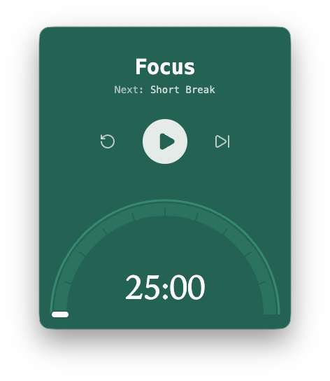

# Pomodoro

A minimal menu-bar pomodoro timer for macOS.

<p align="center">
  
</p>

## Features

- Minimal UI, lives in your menubar
- Reset, pause/play, skip, and draggable progress
- Right-click the menu-bar title for settings
- Completion notification, sleep-safe timing, state restored on relaunch

## Timer cycle

All timings are customizable. By default:

- Focus: 25 minutes
- Short break: 5 minutes
- Long break: 15 minutes
- Long break after 4 completed focus sessions

## Development

Requirements:

- Apple Silicon macOS
- Node.js 22.12 or newer

Start:

```sh
npm install
npm start
```

Other scripts:

```sh
npm test              # Vitest timer suite
npm run typecheck     # TypeScript check
npm run format        # Prettier + Tailwind class sort
npm run package       # Package for host platform
npm run package:mac   # Package Darwin arm64
```

## Install locally

1. On an Apple Silicon Mac, run `npm run package:mac`
2. Drag `out/Pomodoro-darwin-arm64/Pomodoro.app` into `/Applications`
3. Open from Applications or Spotlight
4. Find Pomodoro on your menu bar

## License

BSD 3-Clause; See [LICENSE.md](LICENSE.md).
